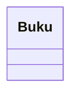
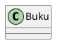

# Panduan Diagram Mermaid dan PlantUML

## Mermaid

Buka file `*.mmd` pada editor yang mendukung Mermaid. Di GitHub, blok Mermaid
juga dapat ditulis di Markdown:

````markdown

````

## PlantUML

Buka file `*.puml` menggunakan plugin PlantUML atau server PlantUML. Struktur
minimal:



## Aturan Penyerahan

Untuk setiap diagram Minggu 4–11, kumpulkan:

1. baseline manual;
2. draf AI (jika digunakan);
3. diagram final (`.mmd` atau `.puml`);
4. hasil evaluasi kritis;
5. matriks traceability ke requirement.

Diagram referensi di repository adalah contoh konsistensi antara requirement,
diagram, dan kode, bukan jawaban tunggal yang harus disalin.
