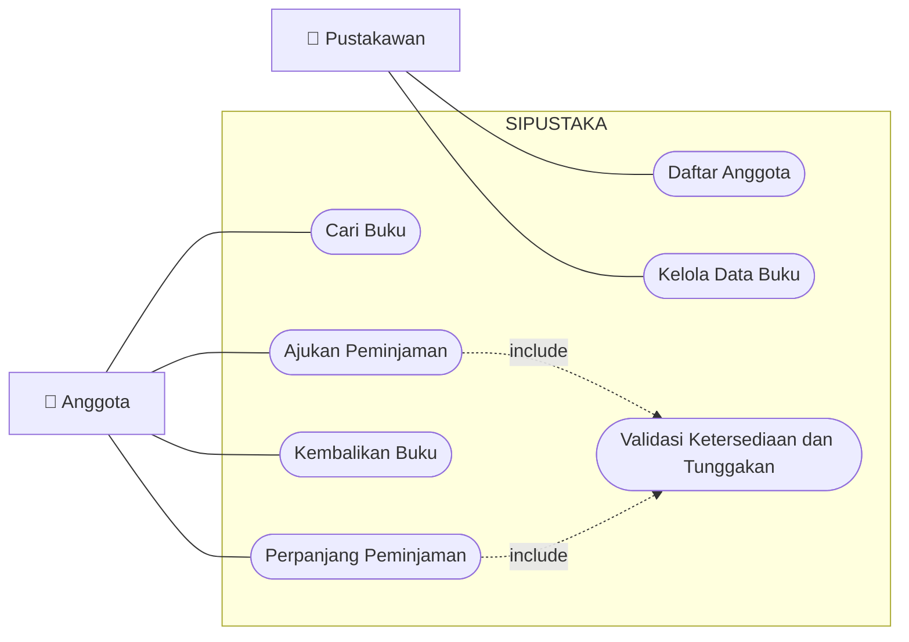
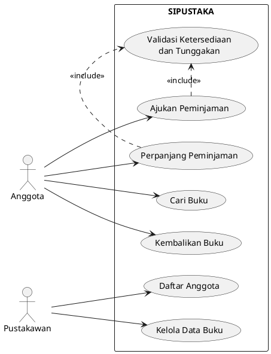
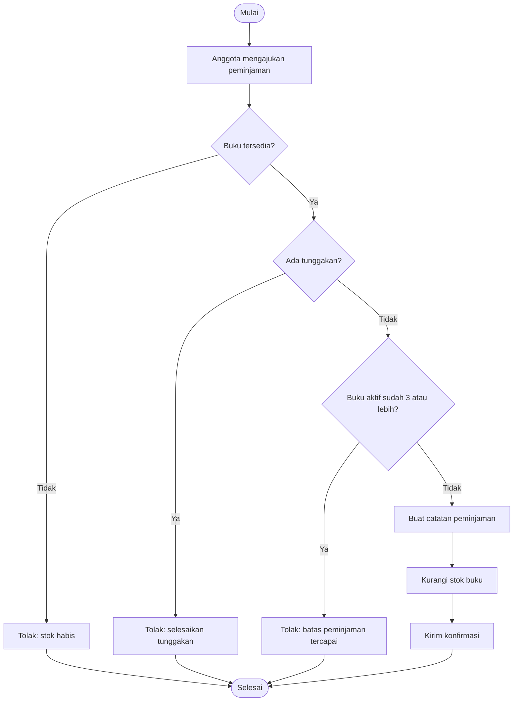
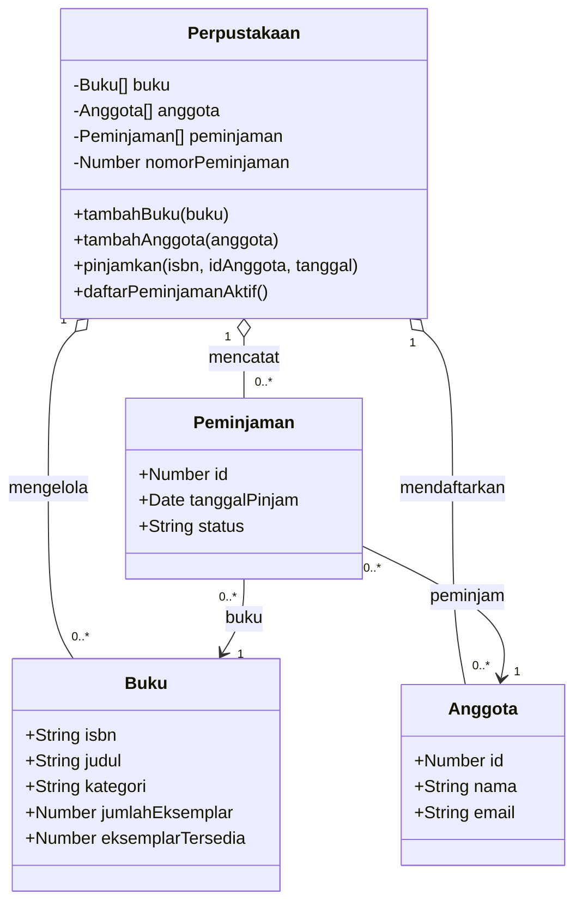
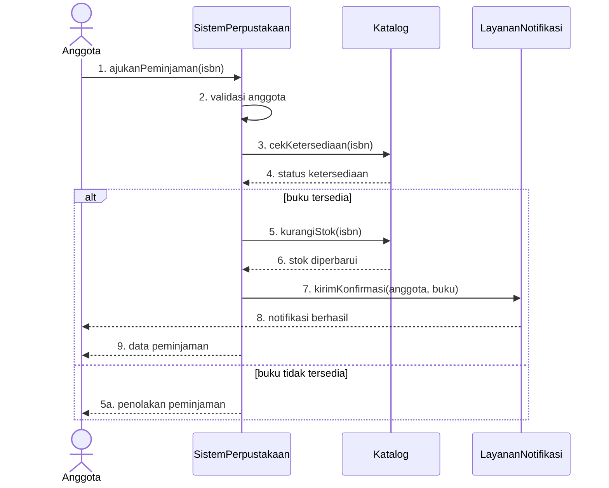
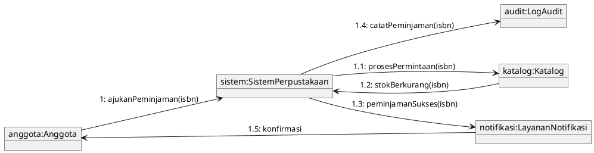
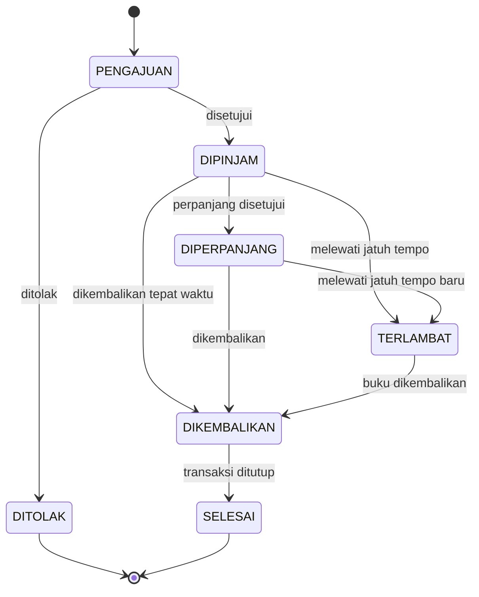
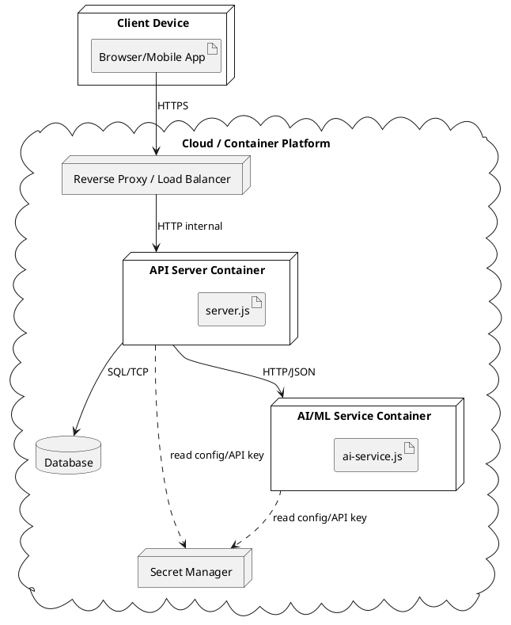

# Software Design Document (SDD) — SIPUSTAKA

> Draf ini dihasilkan otomatis sebagai bahan awal. Mahasiswa wajib memeriksa,
> memperbaiki, dan melengkapi seluruh bagian sebelum dikumpulkan.

## 1. Ringkasan Sistem

SIPUSTAKA adalah sistem manajemen peminjaman buku perpustakaan yang digunakan
sebagai studi kasus Perancangan Berorientasi Objek TI-306.

## 2. Requirement dan User Story

# Analisis Kebutuhan — SIPUSTAKA

## Kebutuhan Fungsional (contoh awal, lengkapi sesuai tugas)

1. Anggota dapat mencari buku berdasarkan judul/kategori.
2. Anggota dapat mengajukan peminjaman buku yang tersedia.
3. Anggota dapat mengembalikan buku yang sedang dipinjam.
4. Pustakawan dapat menambah/mengubah data buku.
5. Pustakawan dapat mendaftarkan anggota baru.

## Kebutuhan Non-Fungsional (contoh awal)

1. Sistem harus menolak peminjaman jika stok buku habis (integritas data).
2. Riwayat peminjaman harus tetap tersimpan meskipun buku sudah dikembalikan.

## User Story

Format: *Sebagai [peran], saya ingin [aksi], agar [tujuan].*

- Sebagai **anggota**, saya ingin mencari buku berdasarkan judul, agar saya cepat
  menemukan buku yang saya butuhkan.
- Sebagai **anggota**, saya ingin meminjam buku yang tersedia, agar saya bisa
  membacanya di luar perpustakaan.
- Sebagai **anggota**, saya ingin melihat tanggal jatuh tempo pengembalian, agar
  saya tidak terkena denda.
- Sebagai **pustakawan**, saya ingin menambahkan judul buku baru, agar koleksi
  perpustakaan selalu ter-update.

## Identifikasi Entitas Awal (calon class)

Dari kebutuhan di atas, entitas yang teridentifikasi: `Buku`, `Anggota`,
`Peminjaman`, `Pustakawan`. Entitas ini akan menjadi dasar Class Diagram di
Minggu 6.

---

## TUGAS LATIHAN
1. Tambahkan minimal **5 kebutuhan fungsional** dan **2 kebutuhan non-fungsional** lain.
2. Tulis minimal **3 user story** tambahan (boleh untuk peran pustakawan).
3. Berdasarkan kebutuhan tambahanmu, apakah ada entitas baru yang perlu
   ditambahkan ke `index.js`? Sebutkan.

## 3. Arsitektur dan Prinsip Desain

- Entitas inti: Buku, Anggota, Peminjaman, Perpustakaan.
- Prinsip OOP: encapsulation, inheritance, polymorphism.
- Pattern: Singleton, Factory, Observer.
- Integrasi eksternal: API Server, database (rencana), dan layanan AI/ML.

## 4. Use Case Diagram

### Mermaid

### PlantUML

## 5. Activity Diagram

## 6. Class Diagram

## 7. Sequence Diagram

## 8. Communication Diagram

## 9. State Machine Diagram

## 10. Deployment Diagram

## 11. Matriks Traceability

| ID | Requirement | Use Case | Activity | Class/Method | Sequence/Communication | State | Deployment | Status |
|---|---|---|---|---|---|---|---|---|
| FR-01 | Cari buku | Cari Buku | Alur pencarian | Katalog.cari | Anggota→Sistem→Katalog | - | Client→API | Perlu verifikasi |
| FR-02 | Ajukan peminjaman | Ajukan Peminjaman | Proses peminjaman | SistemPerpustakaan.ajukanPeminjaman | Sequence peminjaman | PENGAJUAN→DIPINJAM | Client→API→DB | Perlu verifikasi |

## 12. Keamanan dan Kualitas

- Validasi input dan otorisasi belum lengkap pada contoh praktikum.
- API key tidak boleh disimpan di kode/repository.
- Komunikasi produksi harus menggunakan HTTPS.
- Panggilan layanan AI membutuhkan timeout, fallback, rate limit, dan audit.
- Output AI tidak boleh langsung menjadi keputusan tanpa verifikasi manusia.

## 13. Risiko dan Tata Kelola AI

- halusinasi requirement/elemen UML;
- prompt injection dari dokumen eksternal;
- kebocoran data atau kekayaan intelektual;
- permission/scope creep pada AI Agent;
- AI technical debt dan ketergantungan berlebihan.

## 14. Catatan Penggunaan AI

> **Lengkapi oleh mahasiswa**
>
> - Tools dan mode AI:
> - Ringkasan prompt:
> - Baseline manual:
> - Bagian yang dihasilkan AI:
> - Koreksi dan alasan:
> - Log agent (jika ada):

## 15. Keputusan Desain dan Trade-off

Jelaskan keputusan yang diterima/ditolak, alasan penggunaan pattern, serta
keterbatasan rancangan saat ini.
